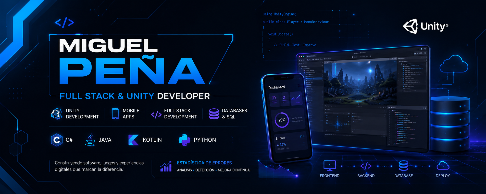

#  Hi, I'm Miguel Peña

  

<h3 align="center">
🎓 Software Engineering Student • 💻 Full Stack & Unity Developer • 🎮 Game Development Enthusiast
</h3>

Passionate about software development, mobile applications, video games, and interactive digital experiences.

---

# 🚀 About Me

I'm a software engineering student focused on building:

- 🎮 Unity video games
- 📱 Mobile applications
- 💻 Full Stack web systems
- 🧠 Interactive software solutions
- 📊 Database-driven applications

Currently improving my skills in:

- Full Stack Development
- Game Development with Unity
- Mobile Development with Kotlin
- Software Architecture
- UI/UX & Interactive Experiences

---

# 🛠️ Tech Stack

## Languages & Frameworks

---

## Tools & Technologies

---

# 🌟 Featured Projects

## 🎮 Unity Projects

- 🚀 Galaga-inspired arcade game
- 🕹️ Platformer prototypes
- 🎯 Gameplay mechanics & procedural systems

## 💻 Software Projects

- 📅 Medical appointment scheduling system
- 🏃 Training management system for speed skating athletes
- 🧠 Stress management app with AI planning features

## 📱 Mobile Development

- Kotlin learning projects
- Mobile productivity & tracking app concepts

---

# 📊 GitHub Stats

---

# 📈 Current Goals

- 🎮 Publish more Unity projects
- 📱 Learn advanced Android development with Kotlin
- ☁️ Improve backend & cloud skills
- 🚀 Build a professional developer portfolio
- 🧠 Create interactive and impactful software

---

# 🌐 Connect With Me

---

# ⚡ Fun Fact

I enjoy combining software engineering, game development, and creative design to build immersive digital experiences.
